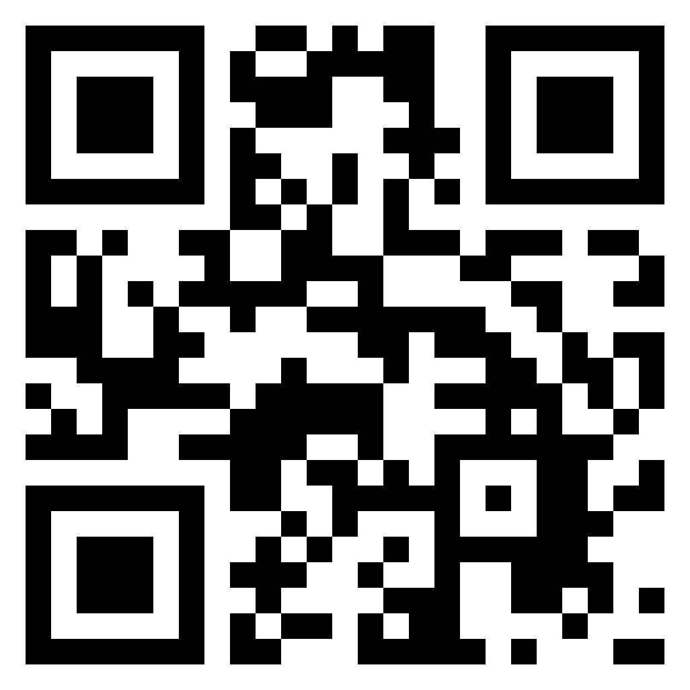

# summer2023-ai-research
Research into artificial intelligence conducted in summer of 2023 (May to August, 2023) under a Truman State University Department of Computer Science grant under the guidance of Dr. Ruthie Halma.

This repository has not been cleaned up and is still considered a work-in-progress.

General work conducted locally on Ubuntu distro through WSL2 (Windows 11).

GUI-related OpenCV implementation conducted locally using Spyder Anaconda (Windows 11).

Model generation and heavy computing conducted virtually on sand virtual machine, Truman State University (*https://sand.truman.edu/*).

Data available on linked Discord server *https://discord.gg/D2JC36t7QE*.

    

## ASL Numbers Superset

### Sign Language Digits Dataset by ***[Turkey Ankara Ayrancı Anadolu High School](http://ayrancianadolu.meb.k12.tr)*** Students

Accessed from *https://www.kaggle.com/datasets/ardamavi/sign-language-digits-dataset*.

Merged from *https://github.com/ardamavi/Sign-Language-Digits-Dataset.git*.

Mavi, A., (2020), “A New Dataset and Proposed Convolutional Neural Network Architecture for Classification of American Sign Language Digits”, arXiv:2011.08927 [cs.CV]

### American Sign Language Dataset by ***Ayush Thakur***

Accessed from *https://www.kaggle.com/datasets/ayuraj/asl-dataset*.

### Synthetic Numbers ASL Numbers by ***Lexset***

Accessed from *https://www.kaggle.com/datasets/lexset/synthetic-asl-numbers*.

<!-- Possible fourth dataset at https://www.kaggle.com/datasets/rayeed045/american-sign-language-digit-dataset -->

## Resources Used (Not Exhaustive)

[Keras API reference](https://keras.io/api/)

[OpenCV-Python Tutorials](https://docs.opencv.org/3.4/d6/d00/tutorial_py_root.html)

[RoboFlow - How to Train MobileNetV2 On a Custom Dataset](https://blog.roboflow.com/how-to-train-mobilenetv2-on-a-custom-dataset/)

[StackOverflow - tensorboard: command not found](https://stackoverflow.com/a/47715665)

For more information, please see attached paper (TBA).

## Future Directions Resources

[Keras.io - KerasCV](https://keras.io/keras_cv/)

### ImageAI

[ImageAI - Official English Documentation for ImageAI!](https://imageai.readthedocs.io/en/latest/index.html)

[ImageAI - Detection Classes](https://imageai.readthedocs.io/en/latest/detection/index.html)

[CodeProject - Training a Custom Model with OpenCV and ImageAI](https://www.codeproject.com/Articles/5270244/Training-a-Custom-Model-with-OpenCV-and-ImageAI)

[CodeProject - Custom Model Object Detection with OpenCV and ImageAI](https://www.codeproject.com/Articles/5270246/Custom-Model-Object-Detection-with-OpenCV-and-Imag)

### Image Annotations

[PyPi - labelImg](https://pypi.org/project/labelImg/)

[VisoAI - Image Annotation: Best Software Tools and Solutions in 2023](https://viso.ai/computer-vision/image-annotation/)

[VisoAI - LabelImg for Image Annotation](https://viso.ai/computer-vision/labelimg-for-image-annotation/)

[Datagen - 5 Image Annotation Tools to Get Your Labeling Project Started](https://datagen.tech/guides/image-annotation/image-annotation-tool/)

[Kaggle, Divyansh Tripathi - Annotate Your Own Image Dataset Efficiently](https://www.kaggle.com/code/divyanshtripathi/annotate-your-own-image-dataset-efficiently/notebook)

[Christian Versloot - how-to-label-your-dataset-for-yolo-object-detection.md](https://github.com/christianversloot/machine-learning-articles/blob/main/how-to-label-your-dataset-for-yolo-object-detection.md)